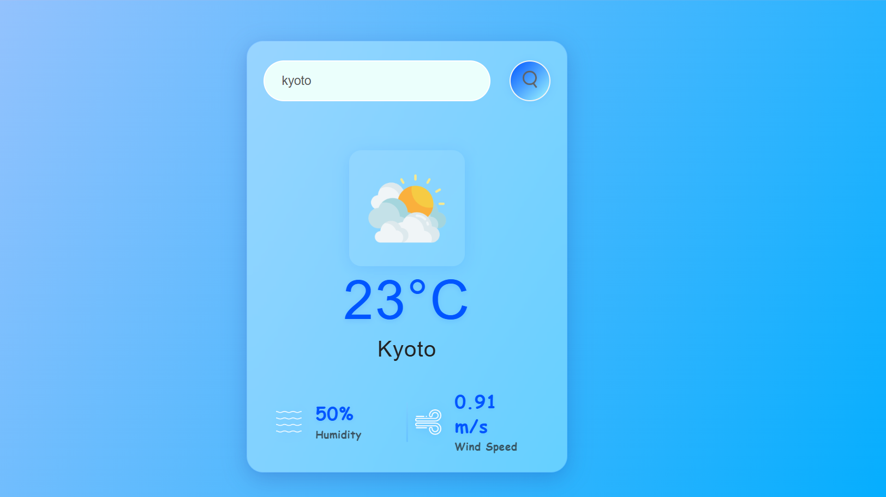

# 🌦️ WEATHER APP

This is a sleek and responsive **Weather App** built using **HTML**, **CSS**, and **JavaScript**. It fetches real-time weather data from the [OpenWeatherMap API](https://openweathermap.org/api) and displays it in an elegant UI.

---

## 🔥 FEATURES

- 🌍 Search by city name
- 🌡️ View temperature, humidity, and wind speed
- 🖼️ Weather-specific icons (Clear, Clouds, Rain, etc.)
- ❗ Error handling for empty or invalid inputs
- ✨ Modern animated and responsive design

---

## 📸 PREVIEW

---

## 🛠️ TECHNOLOGIES USED

- **HTML5** — markup structure  
- **CSS3** — responsive glassmorphic styling  
- **JavaScript** — dynamic functionality and API integration  
- **OpenWeatherMap API** — real-time weather data

---

